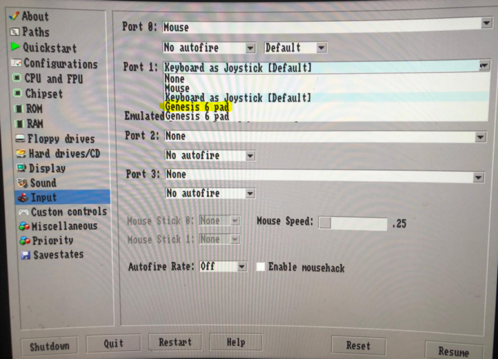

# Dual DB9 GPIO Controllers for Pimiga

## The Pimiga is an Amiga Emulator running Amiberry on Raspberry Pi 400

This is walk through was written based on Pimiga 1.4, however it should be possible to adapt this towards other systems. 

I make no claims to anything - this is purely the process of taking the good work described on the [Retropie GPIO-Modules page](https://retropie.org.uk/docs/GPIO-Modules/#db9_gpio_rpi)

## Concept
Based on the pinouts [Retropie GPIO-Modules page](https://retropie.org.uk/docs/GPIO-Modules/#db9_gpio_rpi) for Sega Genesis 6 button controllers, I made a simple PCB that has two DB9 connectors and the 40 Pin Raspberry Pi GPIO allowing the game controllers to plug into the back of the Pi400.

## Pre-requisites
This walkthough assumes that you have followed the instructions on the Pimiga installation including the installation of the kickstart roms. Only because troubleshooting charges becomes more difficult if you don't have an initial working state.

Install the GPIO/DB9 adapter (while the system is powered off)

## Step 0 - update your system

It's always best to start with a fresh system
```
sudo apt-get update
sudo apt-get upgrade
```

## Step 1 - install the support packages

To build and test the following will be needed
```
sudo apt-get install raspberrypi-kernel-headers dkms joystick
```

## Step 2 - download the DB9 GPIO Driver Source Package

Pull down the latest release and copy it to the /usr/src directory
```
git clone https://github.com/marqs85/db9_gpio_rpi.git
sudo cp -r db9_gpio_rpi/db9_gpio_rpi-1.2/ /usr/src/
```

## Step 3 - use DKMS to build the package

Assuming you are working with version 1.2 of the driver the following will result in the driver being built and installed
```
sudo dkms add db9_gpio_rpi/1.2
sudo dkms build db9_gpio_rpi/1.2
sudo dkms install db9_gpio_rpi/1.2
```

## Step 4 - config controller mapping values

Invoking the driver requires you to specify what type of controllers are plugged in - we can verify which values we need by either checking [Retropie GPIO-Modules page](https://retropie.org.uk/docs/GPIO-Modules/#db9_gpio_rpi) or by double checking in the source code
```shell
pi@Pimiga400:~ $  grep '#define DB9' db9_gpio_rpi/db9_gpio_rpi-1.2/db9_gpio_rpi.c
#define DB9_MAX_DEVICES         2
#define DB9_MULTI_STICK         0x01
#define DB9_MULTI2_STICK        0x02
#define DB9_MULTI3_STICK        0x03
#define DB9_GENESIS_PAD         0x04
#define DB9_GENESIS5_PAD        0x05
#define DB9_GENESIS6_PAD        0x06
#define DB9_SATURN_PAD          0x07
#define DB9_CD32_PAD            0x08
#define DB9_PCENGINE_PAD        0x09
#define DB9_MAX_PAD             0x0A
#define DB9_UP                  0
#define DB9_DOWN                1
#define DB9_LEFT                2
#define DB9_RIGHT               3
#define DB9_FIRE1               4
#define DB9_FIRE2               5
#define DB9_FIRE3               6
#define DB9_SELECT0             6
#define DB9_SELECT1             5
#define DB9_GENESIS_DELAY       5
#define DB9_REFRESH_TIME        HZ/100
#define DB9_SATURN_DELAY 1
#define DB9_SATURN_ANALOG_DELAY 7
```

## Step 5 - Driver Load and Controller verification

For the Genesis (Mega Drive) 6 Button Controllers, we use code 6

So we can load the driver and specify both mapping values to 6 (if you didn't want to use one of the ports you can specify it as 0)

```
sudo insmod /lib/modules/`uname -r`/updates/dkms/db9_gpio_rpi.ko map=6,6
```

If correctly installed (and there are no other joysticks already in the system), we should see these as js0 and js1 respectively

```shell
pi@Pimiga400:~ $ ls /dev/input/js*
/dev/input/js0  /dev/input/js1
```

The jstest program can be used to verify both the hardware and driver

```
jstest /dev/input/js0
```

Moving the D-Pad and pressing buttons should result in the appropriate state changes

Control-C can stop the run, and test with the other controller port

```
jstest /dev/input/js1
```

## Step 6 - Automatically run the driver at system boot

we can edit /etc/rc.local so that the driver is up and running before out main software (amiberry in this case) is started.

In this example we are inserting the driver loading in front of existing line #21 in /etc/local

```
sudo sed -i -e "21isudo insmod /lib/modules/`uname -r`/updates/dkms/db9_gpio_rpi.ko map=6,6" /etc/rc.local
```

We can check if this is correct

```shell
pi@Pimiga400:~ $ cat /etc/rc.local
#!/bin/sh -e
#
# rc.local
#
# This script is executed at the end of each multiuser runlevel.
# Make sure that the script will "exit 0" on success or any other
# value on error.
#
# In order to enable or disable this script just change the execution
# bits.
#
# By default this script does nothing.

# Print the IP address
_IP=$(hostname -I) || true
if [ "$_IP" ]; then
  printf "My IP address is %s\n" "$_IP"
fi
#Suppress Kernel Messages
dmesg --console-off
sudo insmod /lib/modules/5.4.79-v7l+/updates/dkms/db9_gpio_rpi.ko map=6,6
sudo mount /dev/mmcblk0p1 /media/kick
sudo /home/pi/amiberry.sh
exit 0
```

## Step 7 - Reboot and configure Amiberry

To get to the configuration menu of Amiberry you need to press F-12 (Fn + F2)

On the right hand side menu - select "Input" and on Port 1, select "Genesis 6 pad"



Once done, the configuration should be saved to avoid needing to do this every time you start the system.

On the right hand side menu - select "Configurations" and "A1200 (PiMIGA) should already be selected, so you just need to click on "Save"

To exit the configuration menu just press F-12 (Fn + F2) once again and you should be done