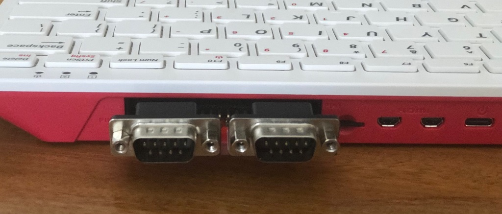
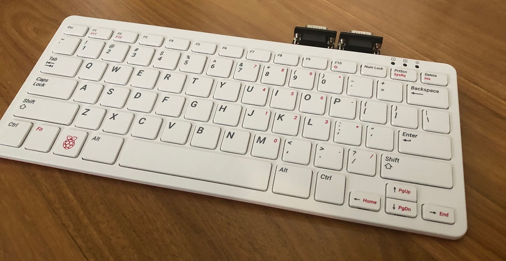
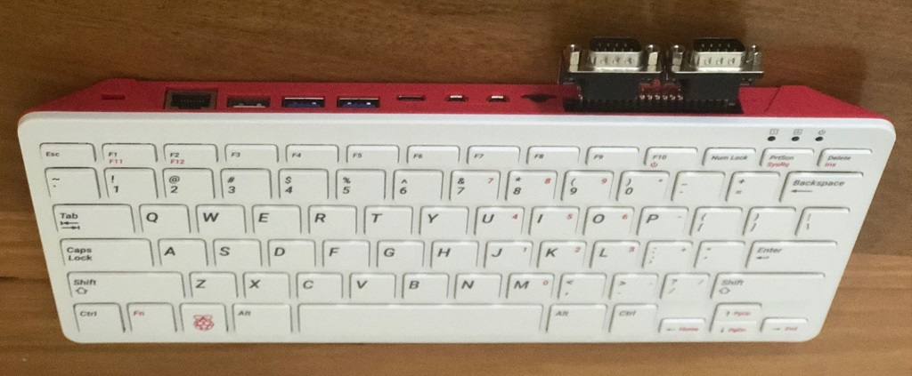
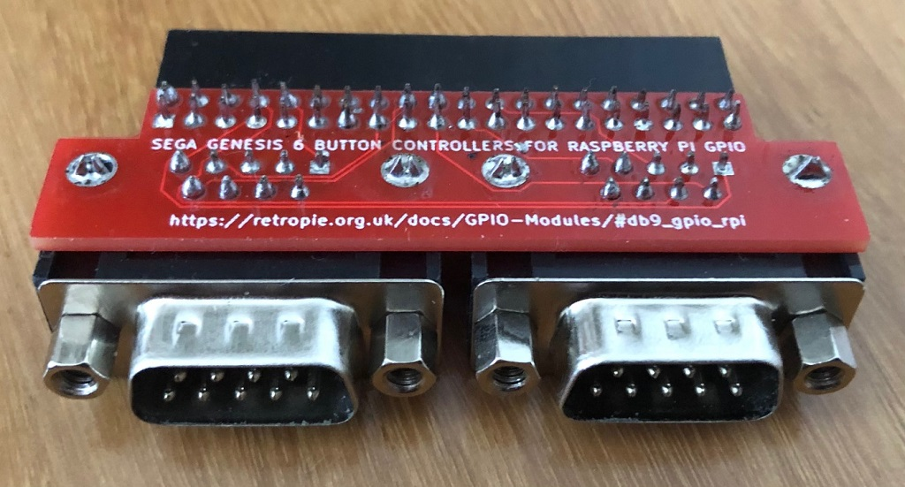
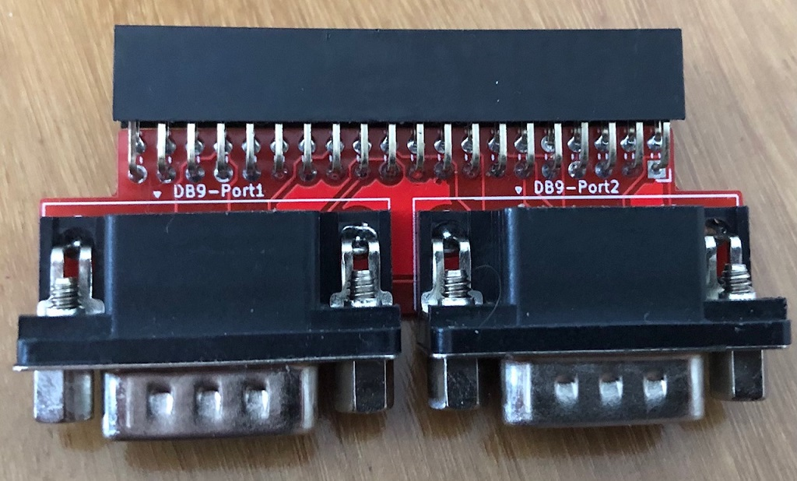

# Dual DB9 GPIO PCB for Raspberry Pi 400



This board can be used on other Raspberry Pi variants, however the location of the GPIO pins might make this otherwise awkward to use.

I make no claims to anything - this is purely the process of taking the good work described on the [Retropie GPIO-Modules page](https://retropie.org.uk/docs/GPIO-Modules/#db9_gpio_rpi) and putting it into kicad

## Concept

The Raspberry Pi400 is very reminiscent of computers from the 80s and 90s including the Commodore Amiga.  This simple project was initiated to support the use of Amiberry and using DB9 based joysticks directly without needing to burn USB ports, however as this is based on works for retropie, it can certainly be used in other situations where the 6 Button Mega Drive (Genesis) controllers are desirable.

## PCB

Gerbers are in the [pcb directory](pcb) these were easily made by any boardhouse.

## Components

These are relatively easy pieces to locate

2 x DB9 Male Right-Angle PCB Mount connectors
1 x 40 Pin right angle Raspberry PI GPIO Header 

## Assembly

It's very simple to assemble and solder, I imagine it would be difficult to get this wrong but double check that you haven't inadvertently introduced bridges between pins.

## Configuration and Usage

If you are using retropie

RetroPie-Setup > Manage Packages > Manage Driver Packages > gamecontroller 

This will get the drivers installed onto your system, however you will need to configure the system to load the driver and specify which controller types you have (6 = 6 Button Genesis pad)

create a new file called db9.conf in /etc/modprobe.d/ with the following contents

```
db9_gpio_rpi map=6,6
```

If you are using PiMiga, I have a [more detailed walkthrough](RaspberryPi400-DB9-PiMiga-Setup.md)

## Additional Pictures







